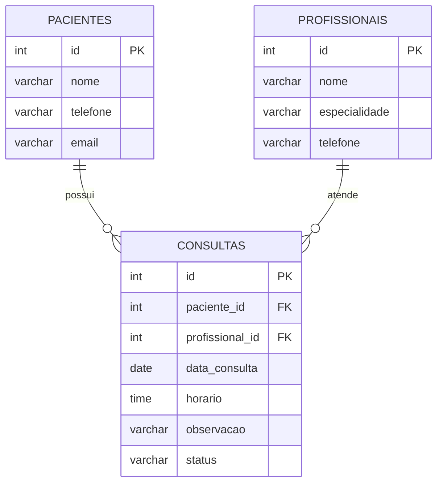
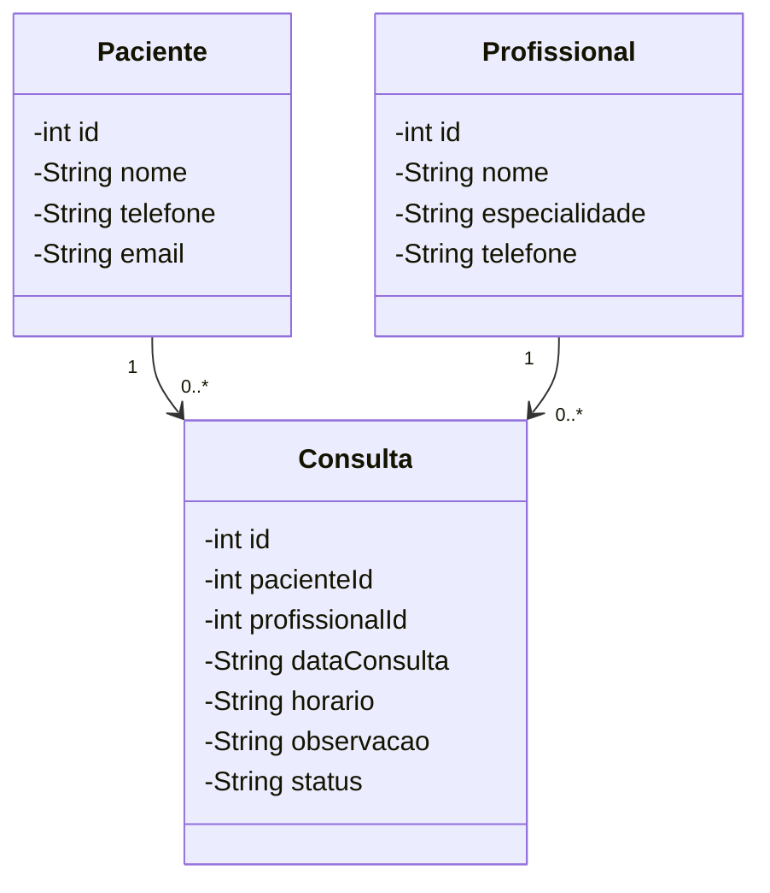

# Diagramas

## DER

```mermaid
erDiagram
    PACIENTES ||--o{ CONSULTAS : possui
    PROFISSIONAIS ||--o{ CONSULTAS : atende

    PACIENTES {
        int id PK
        varchar nome
        varchar telefone
        varchar email
    }

    PROFISSIONAIS {
        int id PK
        varchar nome
        varchar especialidade
        varchar telefone
    }

    CONSULTAS {
        int id PK
        int paciente_id FK
        int profissional_id FK
        date data_consulta
        time horario
        varchar observacao
        varchar status
    }
```

## Diagrama de Classes

```mermaid
classDiagram
    class Paciente {
        -int id
        -String nome
        -String telefone
        -String email
    }

    class Profissional {
        -int id
        -String nome
        -String especialidade
        -String telefone
    }

    class Consulta {
        -int id
        -int pacienteId
        -int profissionalId
        -String dataConsulta
        -String horario
        -String observacao
        -String status
    }

    Paciente "1" --> "0..*" Consulta
    Profissional "1" --> "0..*" Consulta
```

